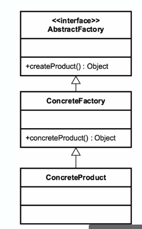

# Abstract Factory

## Concept
Think of it like a factory of factories.

Factory of related objects

Common interface 

Defer to subclasses

examples
* documentBuilder
* frameworks

## Design
Group factories together

Factory is responsible for lifecycle

Common interface

## UML

## Pitfalls
* Complexity - more difficult to development
* Runtime switch (client has switch some people don't like that)
* Pattern within a pattern
* Problem specific
* Usually starts as a factory and is refactored to an abstract factory

## Contrast
| Factory | Abstract Factory |
| --- | --- | 
| Returns various Instances - multiple constructors | implemented with a factory|
| interface driven | hides the factory |
|adaptable to env more easily | adds another abstraction env layer | 
| --- | built through composition| 

## Summary
* Group of similar factories
* More complex than other creation patterns
* Heavy abstraction
* Usually part of framework pattern