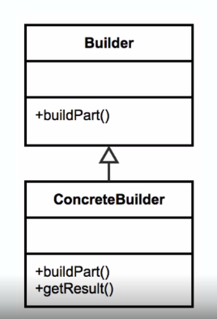

# Builder Pattern
## Why
* Handles complex constructors
* Large number of parameters
* Immutability
* Examples
  * StringBuilder
  * DocumentBuilder
  * LocalBuilder
  
 ## Design
 Helps understand what constructor to use
 
 Flexibility over telescoping constructors (when an class has many constructors possibly)
 
 Static inner class
 
 Calls appropriate constructor (when there are multiple constructors or telescoping constructors)
 
 Negates the need for exposed setters
 
 ## UML
 
 
 ## Example
 * see LunchOrder.class for code
 * see LunchOrderDemo.classfor implementation