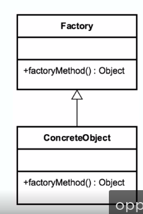

# Factory

## Concept
* Doesn't expose instantiation logic
* Defer to subclasses
* Common interface
* Specified by architecture, implemented by user
* examples in java
  * calendar
  * resource bundle
  * number format
  
## Design
Factory is responsible for lifecycle

Common interface

Concrete Classes

Parameterized create method

Subclasses involved

 ## UML
 
 
 
 ## Pitfalls
 * Complexity
 * Creation takes place in subclasses
 * Usually made from start and not a output of refactoring (usually planned from start)
 
 
 ## Demo vs Example
 * Example is simple version or example
 * Demo = coded demo
   * WebsiteFactory => calls constructor of type item to create
   
 ## Summary
 * Parameter Driven
 * Solves complex creation in different pattern
 * a little complex
 * opposite of a singleton