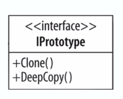

# Prototype

## Concepts
* Avoid costly creation
* Often a refactoring pattern and not a pattern people use up front
* Avoids subclassing
* Typically doesn't use "new"
* Often utilizes an interface
* Usually implemented with a registry (orig object made and then kept in registry then new items closed from it)

## Design
Clone/Cloneable interface to avoid keyword new

Although making a copy each instance is unique

Costly construction not handled by client

Can still utilized parameters for construction

Shallow vs deep copy (shallow = immediate props / deep = every object within)

Every time you make a new item you are using clone which is faster than new so it can be performance gain

## UML

## Pitfalls
* Sometimes not clean whento use
* Used with other patterns
  * Registry
* Shallow VS Deep Copy

## Contrast

| Prototype  | Factory |
| --- | --- |
| lighter weight construction (copy or clone)| flexible objects (multiple constructors)|
| Shallow or deep | concrete instance|
| Copy of itself | fresh instance (using new keyword)| 

## Demo vs Example
* Example is the simple Example they gave
* Demo is a more flushed out demo the walkthrough with coding

## Summary
* guarantee unique instance
* often a refactor
* helps performance creating many objects
* dont always jump to factory sometimes this is better